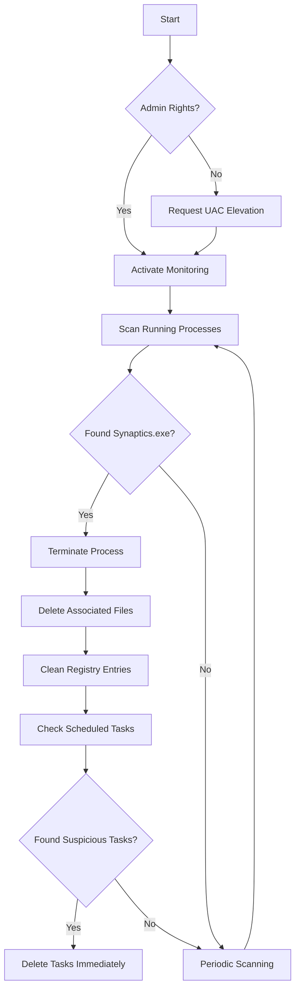

# Synaptics Killer Pro - Advanced Malware Defense System


#  Video
[video](https://github.com/user-attachments/assets/eee59b97-3e0b-4f7b-8ad5-1477e8799a89)
An enterprise-grade solution for detecting and eradicating Synaptics malware with advanced resurrection prevention mechanisms

## Key Features
- ✅ Real-time process monitoring  
- ☢️ Comprehensive file eradication  
- 🔒 Registry protection  
- 📊 Scheduled tasks analysis  
- 🛡️ Advanced file deletion techniques  
- 📈 Detailed logging system

## How It Works


## Installation
```bash
# Install required libraries
pip install -r requirements.txt
```

## Required Libraries
- `psutil` - Process monitoring  
- `colorama` - Console coloring  
- `winreg` - Windows registry access  
- `ctypes` - System-level operations

## Usage
```bash
# Run directly from source
python SynapticsKiller.py

# Compile to EXE (requires pyinstaller)
pip install pyinstaller
pyinstaller --onefile  SynapticsKiller.py

# The compiled EXE will be in dist/ folder
# Note: Run compiled EXE as Administrator
dist\SynapticsKiller.exe
```

## Technical Specifications
- Multi-phase deletion protocols
- File ownership takeover
- PowerShell-enhanced removal
- Registry sterilization
- Real-time process watcher
- Automatic UAC elevation

## License
MIT License - [Da7rkx0](https://github.com/Da7rkx0)
