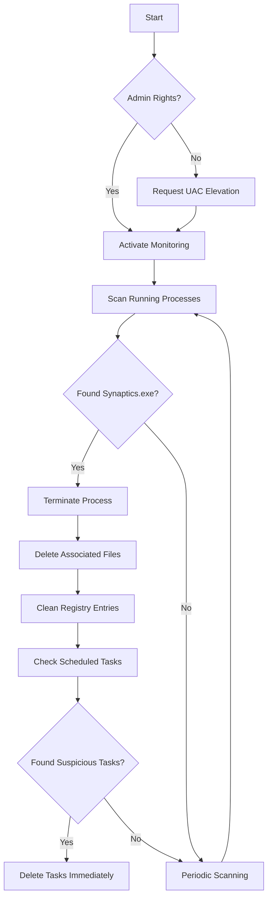

# Synaptics Killer Pro - Advanced Malware Defense System


An enterprise-grade solution for detecting and eradicating Synaptics malware with advanced resurrection prevention mechanisms

## Key Features
- ✅ Real-time process monitoring  
- ☢️ Comprehensive file eradication  
- 🔒 Registry protection  
- 📊 Scheduled tasks analysis  
- 🛡️ Advanced file deletion techniques  
- 📈 Detailed logging system

## How It Works


## Installation
```bash
# Install required libraries
pip install -r requirements.txt
```

## Required Libraries
- `psutil` - Process monitoring  
- `colorama` - Console coloring  
- `winreg` - Windows registry access  
- `ctypes` - System-level operations

## Usage
```bash
python SynapticsKiller.py
```

## Technical Specifications
- Multi-phase deletion protocols
- File ownership takeover
- PowerShell-enhanced removal
- Registry sterilization
- Real-time process watcher
- Automatic UAC elevation

## License
MIT License - [Da7rkx0](https://github.com/Da7rkx0)
