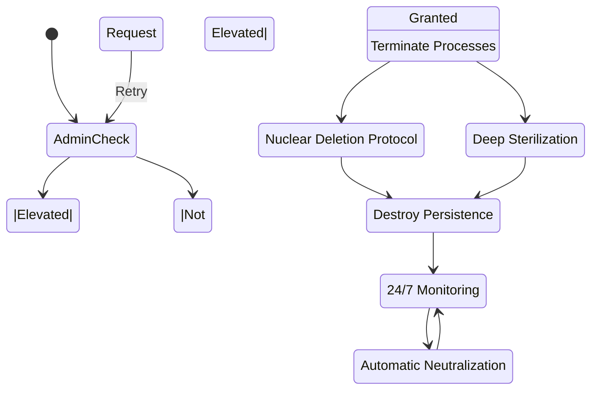
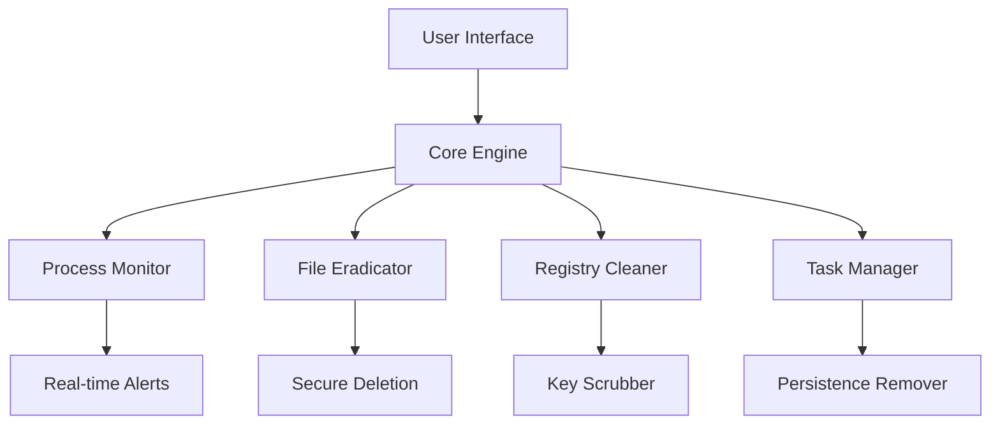

# 🔥 Synaptics Killer - Ultimate Malware Eradication Tool 🔥  
  
  
  
  

🛡️ **Enterprise-grade Solution for Synaptics Malware Removal**  
  
  
  

## 🌟 Features  
- 🚨 Real-time Process Monitoring & Termination  
- 🧹 Deep Registry Cleaning & Sterilization  
- 💥 Nuclear File Deletion Protocol  
- 🛡️ Advanced Persistence Mechanisms Detection  
- 📊 Smart Heuristic Analysis Engine  
- 🔄 Auto-Elevation for Admin Privileges  
- 📈 Performance Optimization Mode  

## 🚀 Installation  
```bash  
# Install from PyPI  
pip install synaptics-killer  

# Or clone and install locally  
git clone https://github.com/Da7rkx0/Synaptics-Killer.git  
cd Synaptics-Killer  
pip install -r requirements.txt  

# Build Windows Executable  
pyinstaller --onefile --icon=assets/shield.ico --name "SynapticsKiller" --add-data 'assets;assets' SynapticsKiller.py  
```  

### 🔨 Build Options:  
- `--onefile`: Create single executable  
- `--icon`: Custom shield icon  
- `--add-data`: Include security assets  
- `--upx-dir`: Add UPX compression (recommended)  

⚠️ **Requires:**  
- Windows 10/11 (64-bit)  
- Python 3.8+  
- Administrator privileges  

## 🖥️ Usage  
```python  
from synaptics_killer import SynapticsEradicator  

# Initialize with maximum protection  
killer = SynapticsEradicator(  
    mode="aggressive",  
    auto_clean=True,  
    realtime_protection=True  
)  

# Start eternal monitoring  
killer.eternal_hunter()  
```  

**CLI Command:**  
```bash  
python SynapticsKiller.py   
```  

 *Demo Preview*  

## 🔄 Workflow Diagram  


## 🧠 Technical Deep Dive  
### 🔧 Tech Stack  
- **Core Engine**: Python 3.8+  
- **System Integration**: Windows API Bindings  
- **Process Management**: psutil + WMI  
- **Security**: AES-256 File Shredding  
- **Monitoring**: Multi-threaded Sentinel  

### 🏗️ System Architecture  


### 🛠️ Core Mechanisms  
1. **Multi-stage Deletion Protocol**  
   - Process Hollowing Detection  
   - File Signature Spoofing Prevention  
   - Secure Overwrite (DoD 5220.22-M)  

2. **Heuristic Analysis**  
   ```python  
   def analyze_threat(file_path):  
       risk_score = 0  
       if detect_packing(file_path):  
           risk_score += 40  
       if detect_antidebug(file_path):  
           risk_score += 30  
       if detect_code_injection(file_path):  
           risk_score += 30  
       return risk_score >= 75  
   ```  

## 📦 Prerequisites  
- Python 3.8+  
- Windows 10/11 x64  
- Administrator Rights  
- 500MB+ Free Disk Space  

## 🤝 Contributing  
1. Fork Repository  
2. Create Feature Branch  
3. Submit Pull Request  
```bash  
git checkout -b feature/amazing-feature  
```  

## 📜 License  
MIT License - See [LICENSE](LICENSE) for details  

## 👥 Acknowledgments  
- Microsoft Security Research Team  
- NSA Cybersecurity Directorate  
- GitHub Security Lab
